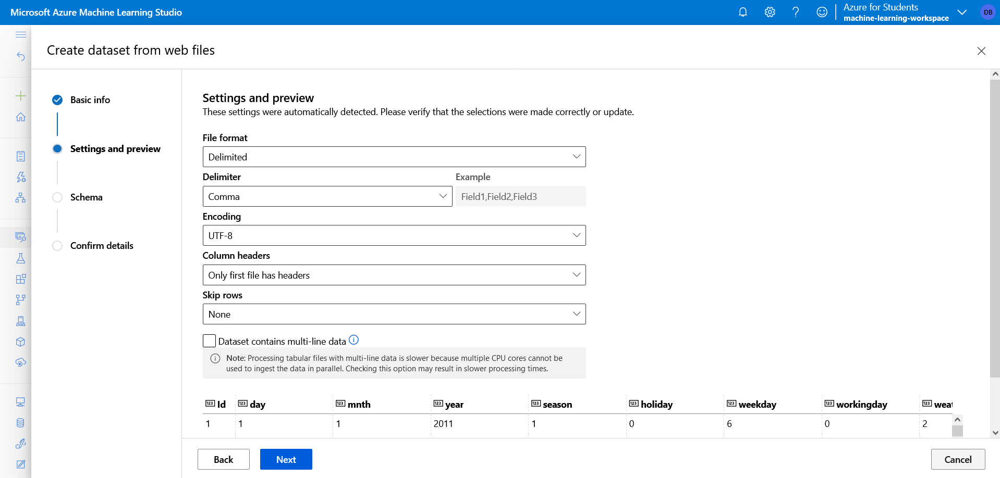

# Exploración de datos

Los modelos de Machine Learning deben entrenarse con los datos existentes. En este caso, se usará un conjunto de datos de información histórica de alquiler de bicicletas para entrenar un modelo que prediga el número de alquileres de bicicletas que se espera un día determinado, en función de las características estacionales y meteorológicas.

## Crear un conjunto de datos

1. Vea los datos separados por comas en https://aka.ms/bike-rentals, en el explorador web.
2. En Azure Machine Learning Studio, expandir el panel izquierdo seleccionando las tres líneas de la parte superior izquierda de la pantalla. Vea la página **Datos** (en **Activos**). La página Datos contiene archivos de datos o tablas específicos con los que tiene previsto trabajar en Azure Machine Learning. También se pueden crear conjuntos de datos desde esta página.
3. Crear un conjunto de datos nuevo a partir de archivos web con los valores siguientes:
    + **Información básica**:
        + **Dirección URL web**: https://aka.ms/bike-rentals.
        + **Nombre**: bike-rentals.
        + **Tipo de conjunto de datos**: tabular
        + **Descripción**: datos de alquiler de bicicletas.

    + **Configuración y vista previa**:
        + **Formato de archivo**: delimitado
        + **Delimitador**: coma
        + **Codificación**: UTF-8
        + **Encabezados de columna**: solo el primer archivo tiene encabezados
        + **Omitir filas**: ninguno
        + **El conjunto de datos contiene datos de varias líneas**: no seleccionar
    + **Esquema**:
        + Incluir todas las columnas que no sean Ruta de acceso
        + Revisar los tipos detectados automáticamente
    + **Confirmación de detalles**:
        + No generar perfil de este conjunto de datos después de su creación

4. Después de crear el conjunto de datos, ábralo y vea la página **Explorar** para obtener una muestra de los datos. Estos datos contienen las características históricas y las etiquetas para los alquileres de bicicletas.

> **Cita**: Estos datos se derivan de [*Capital Bikeshare*](https://ride.capitalbikeshare.com/system-data) y se utilizan de acuerdo con el contrato de licencia de los datos publicados.
