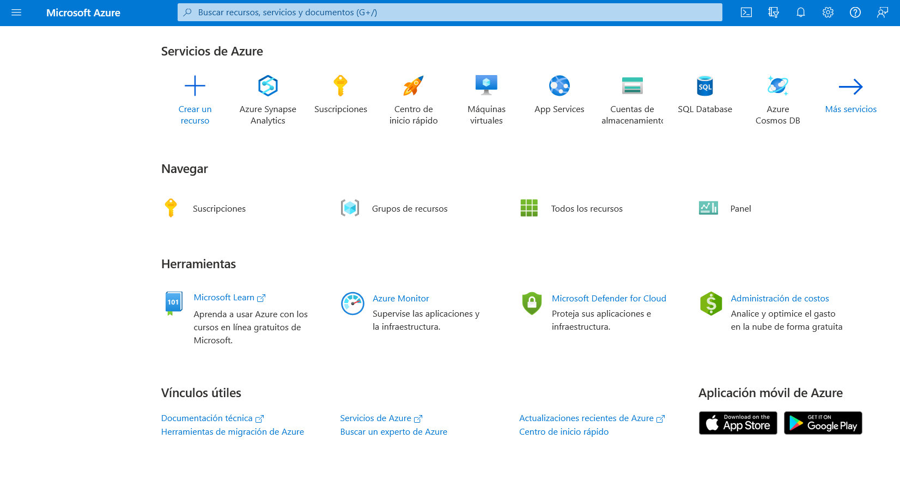
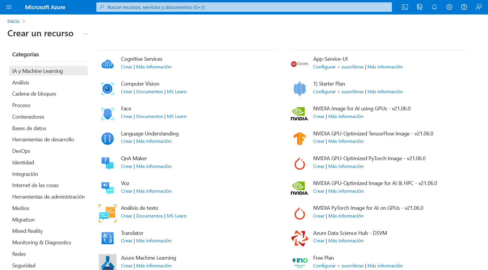
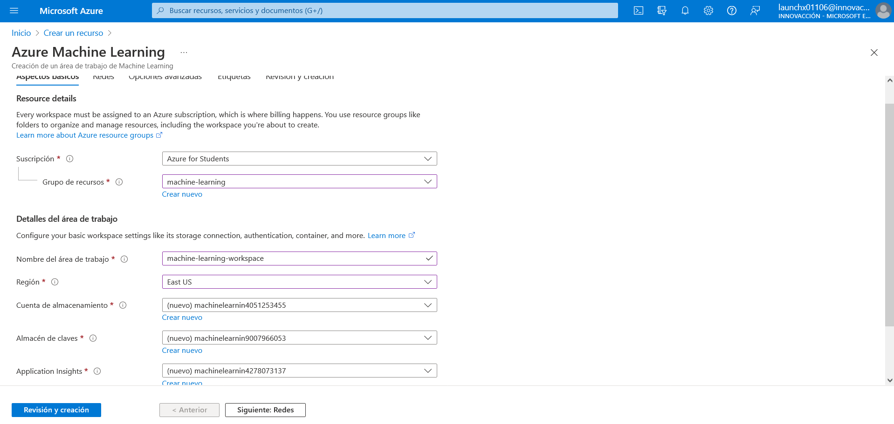
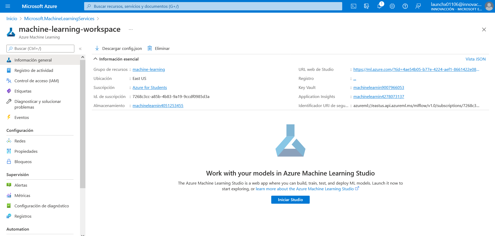
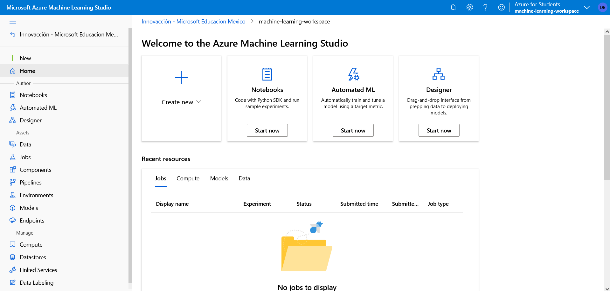

# Creación de un área de trabajo de Azure Machine Learning

1. Iniciar sesión en [Azure Portal](https://portal.azure.com/) con las credenciales de Microsoft.

2. Seleccionar **＋ Crear un recurso**, buscar Machine Learning y crear un recurso de Machine Learning con los valores siguientes:
    + **Suscripción**: suscripción de Azure
    + **Grupo de recursos**: crear o seleccionar un grupo de recursos.
    + **Nombre del área de trabajo**: escribir un nombre único para el área de trabajo.
    + **Región**: seleccionar la región geográfica más cercana.
    + **Cuenta de almacenamiento**: tener en cuenta la nueva cuenta de almacenamiento predeterminada que se creará para el área de trabajo.
    + **Almacén de claves**: tener en cuenta el nuevo almacén de claves predeterminado que se creará para el área de trabajo.
    + **Application Insights**: tener en cuenta el nuevo recurso de Application Insights predeterminado que se creará para el área de trabajo.
    + **Registro de contenedor**: ninguno (se creará uno automáticamente la primera vez que implemente un modelo en un contenedor).
  

3. Esperar a que se cree el área de trabajo (puede tardar unos minutos). Después, ve a ella en el portal.

4. En la página **Información general** del área de trabajo, iniciar Estudio de Azure Machine Learning (o abrir una nueva pestaña del explorador e ir a <https://ml.azure.com>), e iniciar sesión en Estudio de Azure Machine Learning con la cuenta de Microsoft.

5. En Estudio de Azure Machine Learning, alternar el icono ☰ de la parte superior izquierda para ver las distintas páginas de la interfaz. Puede usar estas páginas para administrar los recursos en el área de trabajo.

Se puede administrar el área de trabajo mediante Azure Portal, pero para los científicos de datos y los ingenieros de operaciones de Machine Learning, Azure Machine Learning Studio proporciona una interfaz de usuario más centrada a fin de administrar los recursos del área de trabajo.
