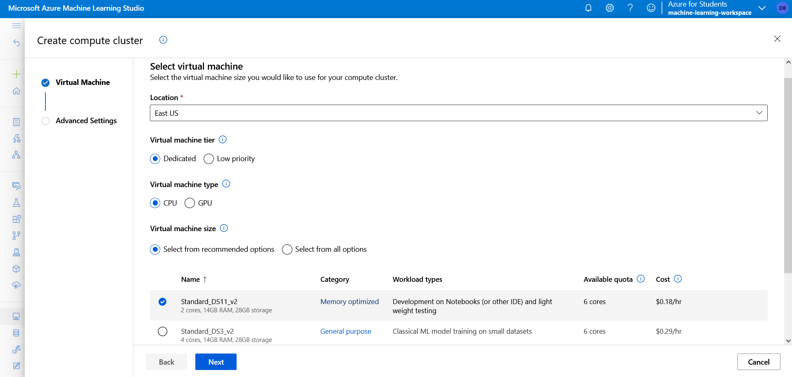

# Creación de recursos de proceso

## Creación de un clúster de proceso

Los destinos de proceso son recursos basados en la nube en los que se pueden ejecutar procesos de entrenamiento de modelos y exploración de datos.

En Azure Machine Learning Studio, vaya a la página **Proceso**, en **Administrar**. Aquí es donde se administran los destinos de proceso para las actividades de ciencia de datos. Puede crear cuatro tipos de recursos de proceso:

+ **Instancias de proceso**: estaciones de trabajo de desarrollo que los científicos de datos pueden usar para trabajar con datos y modelos.
+ **Clústeres de proceso**: clústeres escalables de máquinas virtuales para el procesamiento a petición de código de experimento.
+ **Clústeres de inferencia**: destinos de implementación para servicios predictivos que usan los modelos entrenados.
+ **Proceso asociado**: vínculos a recursos de proceso de Azure existentes, como clústeres de Azure Virtual Machines o Azure Databricks.

> **Nota**
Las instancias de proceso y los clústeres se basan en imágenes de máquina virtual de Azure estándar. Para este módulo, se recomienda la imagen Standard_DS11_v2 para lograr el equilibrio óptimo entre el costo y el rendimiento. Si la suscripción tiene una cuota que no incluye esta imagen, elija una imagen alternativa, pero tenga en cuenta que una imagen más grande puede incurrir en un costo mayor y una imagen más pequeña puede no ser suficiente para completar las tareas. Como alternativa, pida al administrador de Azure que amplíe la cuota.

1. Cambiar a la pestaña **Clústeres de proceso** y agregar un clúster de proceso nuevo con la configuración siguiente. Se usará para entrenar un modelo de Machine Learning:

    + **Ubicación**: seleccione la misma que el área de trabajo. Si esa ubicación no aparece, elija la más cercana.
    + **Nivel de máquina virtual**: dedicado
    + **Tipo de máquina virtual**: CPU
    + **Tamaño de la máquina virtual**:
        + Elija Seleccionar de entre todas las opciones
        + Busque y seleccione Standard_DS11_v2
    + **Nombre del proceso**: escriba un nombre único
    + **Número mínimo de nodos**: 0
    + **Número máximo de nodos**: 2
    + **Segundos de inactividad antes de la reducción vertical**: 120
    + **Habilitar acceso SSH**: no seleccionado

