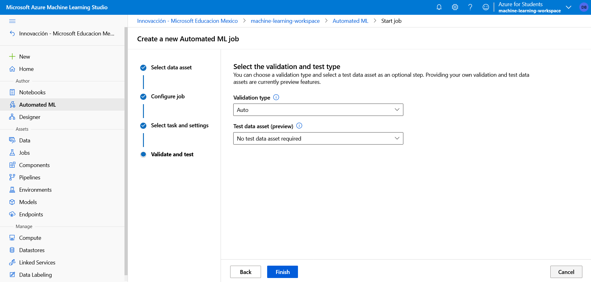

# Entrenar un modelo de Machine Learning

## Ejecución de un experimento de aprendizaje automático automatizado

En Azure Machine Learning, las operaciones que se ejecutan se denominan experimentos. Siga los pasos para ejecutar un experimento que use el aprendizaje automático automatizado con el fin de entrenar un modelo de regresión que prediga los alquileres de bicicletas.

1. En Azure Machine Learning Studio, vaya a la página **ML automatizado**.

2. Cree una ejecución de ML automatizado con la configuración siguiente:
    + **Selección del conjunto de datos**:
        + Conjunto de datos: bike-rentals.
    + **Configuración de la ejecución**:
        + Nuevo nombre del experimento: mslearn-bike-rental.
        + Columna de destino: alquileres (esta es la etiqueta que tiene que predecir el modelo entrenado).
        + Seleccionar clúster de proceso: el clúster de proceso que creó anteriormente.
    + **Selección de tarea y configuración**:
        + Tipo de tarea: regresión (el modelo predice un valor numérico).

Observe que en el tipo de tarea hay las opciones *View additional configuration settings* (Ver opciones de configuración adicionales) y *View Featurization settings* (Ver opciones de caracterización). Ahora configure estas opciones.

   + **Opciones de configuración adicionales**:
      + **Métrica primaria**: seleccione **Error de desviación media cuadrática normalizada**.
      + **Explain best model** (Explicar el mejor modelo): *seleccionado: esta opción hace que el aprendizaje automático automatizado calcule la importancia de la característica para el mejor modelo, lo que permite determinar la influencia de cada característica en la etiqueta de predicción*.
      + **Use all supported models** (Usar todos los modelos admitidos): no seleccionado. *Restringirá el experimento para probar solo algunos algoritmos específicos*.
      + **Allowed models** (Modelos permitidos): seleccione solo **RandomForest** y **LightGBM**: normalmente, le gustaría probar tantos como sea posible, pero cada modelo agregado aumenta el tiempo que se tarda en ejecutar el experimento.
      + **Criterio de salida**:
        + **Training job time (hours)** (Tiempo del trabajo de entrenamiento [horas]): 0,5: esto hace que el experimento finalice después de un máximo de 30 minutos.
        + **Metric score threshold** (Umbral de puntuación de métrica): 0,085: esto hace que el experimento finalice si un modelo logra una puntuación de métrica de raíz del error cuadrático medio normalizado de 0,085 o menos.
        + **Simultaneidad**: no cambiar.
   + **Configuración de caracterización**:
     + **Enable featurization** (Habilitar caracterización): seleccionada: procese previamente de forma automática las características antes del entrenamiento.

Haga clic en **Siguiente** para ir al siguiente panel de selección.

   + **[Opcional] Selección del tipo de prueba y validación**
     + **Tipo de validación**: Automático
     + **Conjunto de datos de prueba (versión preliminar)**: No se requiere ningún conjunto de datos de prueba

3. Cuando termine de enviar los detalles de la ejecución de ML automatizado, se iniciará automáticamente. Espere a que el estado de ejecución cambie de *Preparando* a *En ejecución*.

4. Cuando el estado de ejecución cambia a *En ejecución*, vea la pestaña **Modelos** y observe que se prueba cada combinación posible de algoritmos de entrenamiento y pasos de preprocesamiento y se evalúa el rendimiento del modelo resultante. La página se actualiza frecuentemente de forma automática, pero también puede seleccionar ↻ **Actualizar**. Los modelos pueden tardar unos 10 minutos en aparecer, ya que los nodos de clúster se deben inicializar antes de que pueda comenzar el entrenamiento.

5. Espere a que finalice el experimento. Este proceso puede tardar un poco.

## Revisión del mejor modelo

Una vez finalizado el experimento, puede revisar el modelo de mejor rendimiento. En este caso, se ha usado criterios de salida para detener el experimento. Por lo tanto, el "mejor" modelo que generó el experimento podría no ser el mejor modelo posible, sino solo el mejor que se encuentra en el tiempo permitido para este ejercicio.

1. En la pestaña **Detalles** de la ejecución del ML automatizado, tenga en cuenta el resumen del mejor modelo.

2. Seleccione el **Nombre del algoritmo** para el mejor modelo a fin de ver sus detalles.

    El mejor modelo se identifica en función de la métrica de evaluación que se haya especificado *raíz del error cuadrático medio normalizado*.

    Para calcular la métrica de evaluación se usa una técnica denominada *validación cruzada*. Una vez entrenado el modelo con una parte de los datos, la parte restante se usa para probar de forma iterativa o validar de forma cruzada el modelo entrenado. La métrica se calcula comparando el valor previsto de la prueba con el valor conocido real o la etiqueta.

    La diferencia entre el valor previsto y el real, conocido como *valores residuales*, indica la cantidad de error en el modelo. La métrica de rendimiento concreta que usó, la raíz del error cuadrático medio normalizado, se calcula igualando los errores en todos los casos de prueba, buscando la media de estos cuadrados y, después, tomando la raíz cuadrada. Lo que significa todo esto es que cuanto menor sea este valor, más precisa serán las predicciones del modelo.

3. Junto al valor del *Error de desviación media cuadrática normalizada*, seleccione **Ver todas las demás métricas** a fin de ver los valores de otras métricas posibles de evaluación para un modelo de regresión.

4. Seleccione la pestaña **Métricas** y seleccione los gráficos **valores residuales** y **predicted_true** si aún no están seleccionados.

Revise los gráficos en los que se muestran el rendimiento del modelo. El gráfico compara los valores previstos con los valores reales y muestra los valores residuales, las diferencias entre los valores previstos y los reales, como un histograma.

El gráfico **Valores previstos frente a los reales** debe mostrar una tendencia diagonal en la que el valor previsto se correlacione estrechamente con el valor verdadero. La línea de puntos muestra cómo debe realizarse un modelo perfecto. Cuanto más se acerque la línea del valor previsto promedio del modelo a la línea de puntos, mejor será su rendimiento. Un histograma debajo del gráfico de líneas muestra la distribución de los valores verdaderos.

En el **Histograma de valores residuales** se muestra la frecuencia de los intervalos de los valores residuales. Los valores residuales representan la varianza entre los valores previstos y los reales que el modelo no puede explicar, es decir, los errores. Debería esperar ver los valores residuales que se producen con más frecuencia agrupados en torno a cero. Quiere reducir los errores con menos errores en los extremos de la escala.

5. Seleccione la pestaña **Explicaciones**. Seleccione un identificador de explicación y, a continuación, seleccione **Aggregate feature Importance** (Importancia de la característica agregada). En este gráfico se muestra el grado en que cada característica del conjunto de datos influye en la predicción de la etiqueta, como esto:

