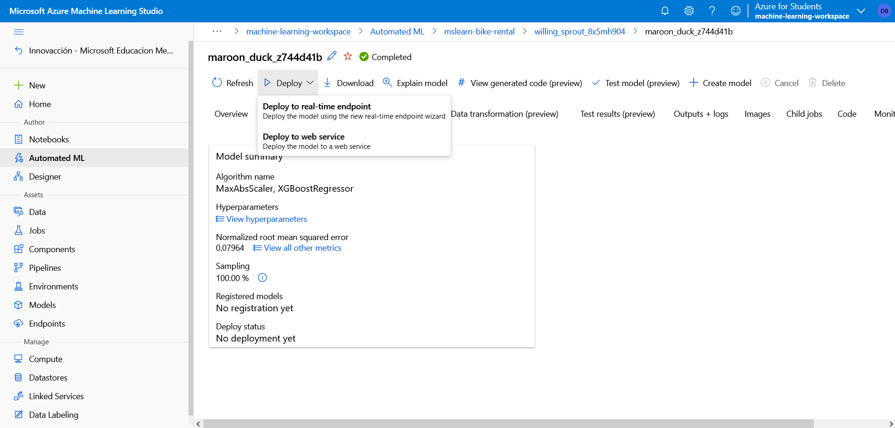
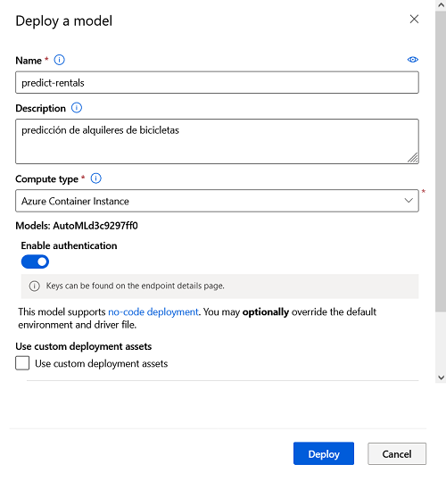
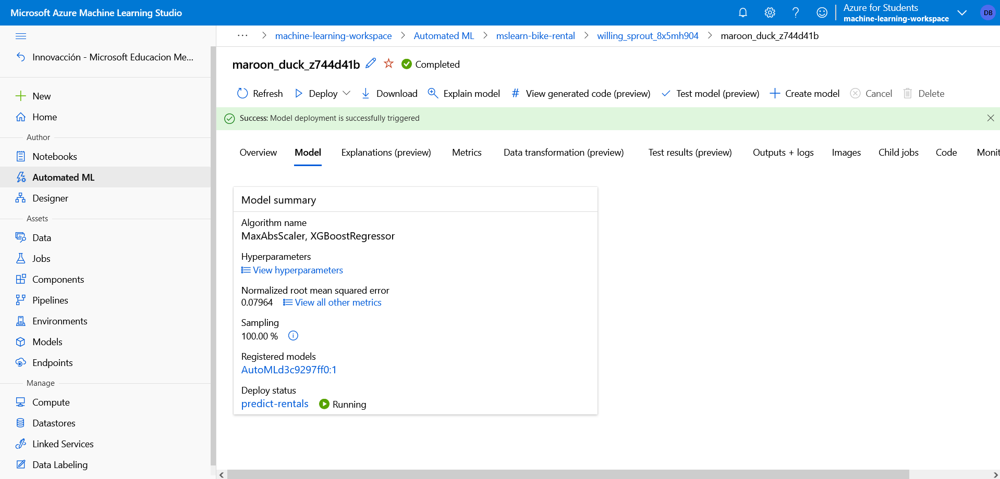
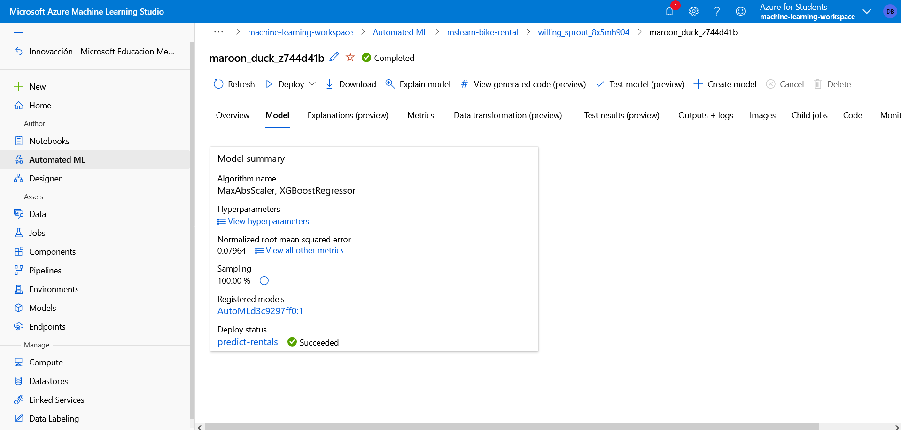
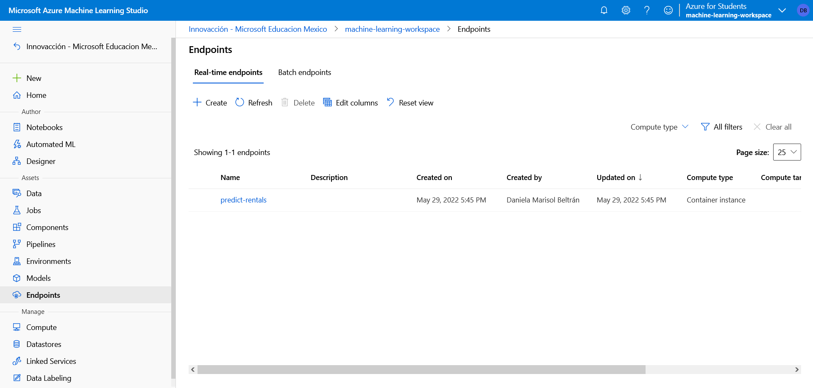
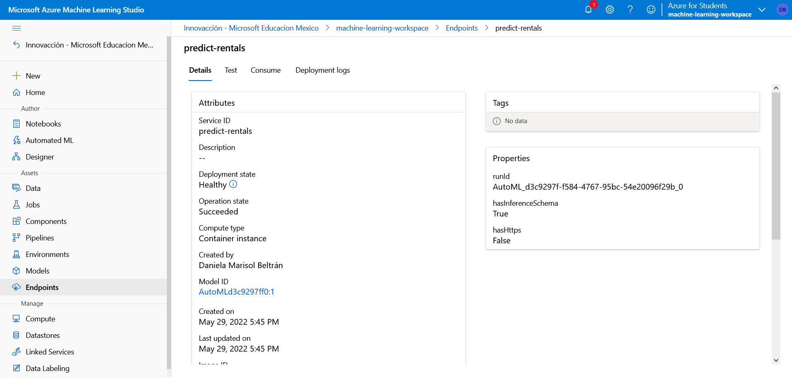
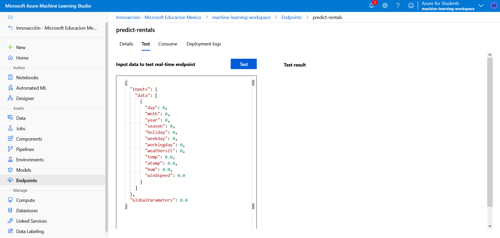
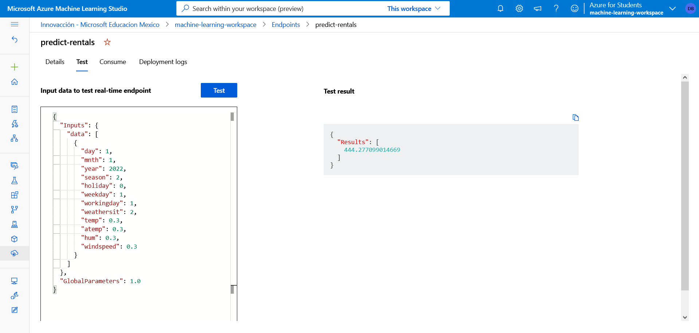

# Implementación de un modelo como servicio

## Implementación de un servicio predictivo

En Azure Machine Learning, puede implementar un servicio como una instancia de Azure Container Instances (ACI) o en un clúster de Azure Kubernetes Service (AKS). En escenarios de producción, se recomienda una implementación de AKS, para lo cual debe crear un destino de proceso de clúster de inferencia. En este ejercicio usará un servicio ACI, que es un destino de implementación adecuado para las pruebas y no requiere la creación de un clúster de inferencia.

1. En Estudio de Azure Machine Learning, en la página **ML automatizado**, seleccione la ejecución de su experimento de aprendizaje automático automatizado.

2. En la pestaña **Detalles**, seleccione el nombre del algoritmo para el mejor modelo.

3. En la pestaña **Modelo**, seleccione el botón **Implementar** y use la opción **Deploy to web service** (Implementar en el servicio web) para implementar el modelo con la configuración siguiente:
   + **Nombre**: predict-rentals
   + **Descripción**: predicción de alquileres de bicicletas
   + **Tipo de proceso**: instancia de Azure Container
   + **Habilitar autenticación**: seleccionado





4. Espere a que se inicie la implementación; esto puede tardar unos segundos. Después, en la sección **Resumen de modelo**, observe el **Deploy status** (Estado de la implementación) para el servicio **predict-rentals**, que debe ser **En ejecución**. Espere a que este estado cambie a **Correcto**, lo que puede tardar un tiempo. Es posible que tenga que seleccionar ↻ **Actualizar** frecuentemente.





5. En Azure Machine Learning Studio, vaya a la página **Puntos de conexión** y seleccione el punto de conexión en tiempo real **predict-rentals**. Luego, seleccione la pestaña **Consumir** y tenga en cuenta la información siguiente. Si no ve la pestaña **Consumir**, significa que la implementación no se completó totalmente. Deberá esperar y actualizar la página. Necesitará la información de la pestaña **Consumir** para conectarse al servicio implementado desde una aplicación cliente.
   + El punto de conexión REST para el servicio
   + Clave principal o secundaria del servicio





## Prueba del modelo implementado

Ahora puede probar el servicio implementado.

1. En la página **Puntos de conexión**, abra el punto de conexión en tiempo real **predict-rentals**.
2. Cuando se abra el punto de conexión **predict-rentals**, consulte la pestaña **Probar**.



3. En el panel de datos de entrada, reemplace la plantilla JSON por los datos de entrada siguientes:

```json
{
  "Inputs": { 
    "data": [
      {
        "day": 1,
        "mnth": 1,   
        "year": 2022,
        "season": 2,
        "holiday": 0,
        "weekday": 1,
        "workingday": 1,
        "weathersit": 2, 
        "temp": 0.3, 
        "atemp": 0.3,
        "hum": 0.3,
        "windspeed": 0.3 
      }
    ]    
  },   
  "GlobalParameters": 1.0
}
```


4. Haga clic en el botón **Probar**.

5. Revise los resultados de la prueba, que incluyen un número previsto de alquileres en función de las características de entrada. El panel de prueba tomó los datos de entrada y utilizó el modelo entrenado para devolver el número de alquileres previsto.



El modelo predice el número de alquileres de bicicletas que se espera en un día determinado, en función de las **características** estacionales y meteorológicas. En este caso, las **etiquetas** son el número de bicicletas alquiladas.
